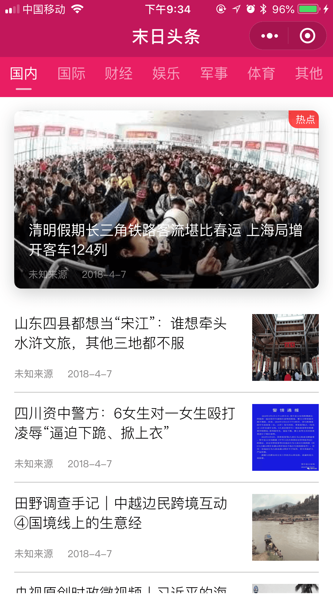

# Udacity微信小程序纳米学位实战项目1——新闻小程序

## 项目简介

本代码库为Udacity微信小程序纳米学位实战项目，项目相关介绍及所使用的API介绍如下所示:

1. [项目介绍](https://github.com/udacity/wmpnd-news)
2. [新闻API接口介绍](https://github.com/udacity/wmpnd-news/blob/master/news_api.md)

## 功能简介

1. 实现通过接口获取新闻列表数据并在新闻列表界面中显示;
2. 实现通过点击新闻类别选项卡切换不同新闻列表的功能；
3. 实现通过左右滑动列表页面来切换不同新闻列表的功能；
4. 实现通过下拉刷新更新新闻列表的功能；
5. 实现通过点击任意新闻列表项目跳转至新闻详情页的功能；
6. 实现在新闻详情页能够通过下来刷新更新详情页的功能;

## 截图展示

